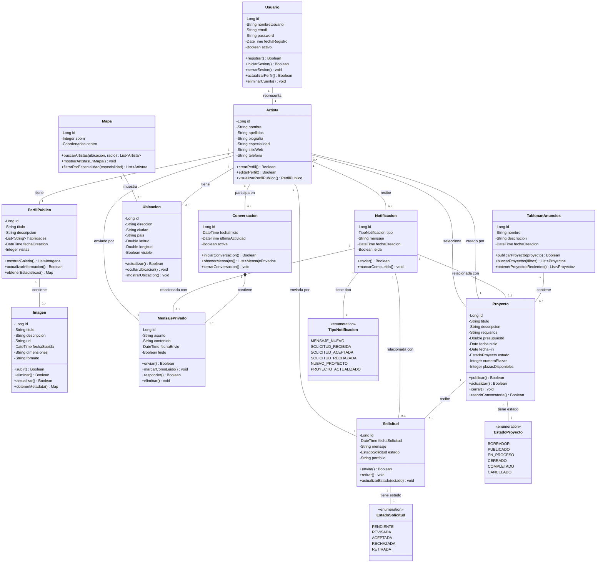

# Diagrama UML en Mermaid

Este archivo contiene el diagrama UML en formato Mermaid, que se renderiza automáticamente en GitHub.

## Diagrama de Clases



## Descripción de Componentes

### Módulo de Usuario y Autenticación
- **Usuario**: Gestiona credenciales y autenticación
- **Artista**: Perfil profesional del artista

### Módulo de Perfil Público
- **PerfilPublico**: Información visible del artista
- **Imagen**: Galería de trabajos artísticos

### Módulo de Mensajería
- **Conversacion**: Hilo de mensajes entre artistas
- **MensajePrivado**: Mensajes individuales

### Módulo de Geolocalización
- **Ubicacion**: Localización del artista
- **Mapa**: Visualización de artistas en el mapa

### Módulo de Proyectos
- **TablonanAnuncios**: Gestión del tablón
- **Proyecto**: Anuncio de proyecto colaborativo
- **Solicitud**: Aplicación a un proyecto

### Módulo de Notificaciones
- **Notificacion**: Sistema de alertas

## Flujos Principales

### 1. Registro y Creación de Perfil
```
Usuario → registrar()
Usuario → Artista
Artista → crearPerfil()
Artista → PerfilPublico
PerfilPublico → Imagen (subir trabajos)
```

### 2. Búsqueda de Artistas
```
Usuario → Mapa
Mapa → buscarArtistas()
Mapa → mostrarArtistasEnMapa()
Usuario → selecciona Artista
Usuario → visualiza PerfilPublico
```

### 3. Contacto con Artista
```
Artista → iniciarConversacion(otroArtista)
Conversacion → MensajePrivado (enviar)
Sistema → Notificacion (MENSAJE_NUEVO)
```

### 4. Publicación de Proyecto
```
Artista → TablonanAnuncios
TablonanAnuncios → publicarProyecto()
Proyecto → cambiar estado a PUBLICADO
Sistema → Notificacion (NUEVO_PROYECTO)
```

### 5. Aplicación a Proyecto
```
Artista → Proyecto (ver)
Artista → Solicitud (enviar)
Sistema → Notificacion (SOLICITUD_RECIBIDA)
Creador → revisar Solicitud
Creador → actualizarEstado(ACEPTADA/RECHAZADA)
Sistema → Notificacion (SOLICITUD_ACEPTADA/RECHAZADA)
```
